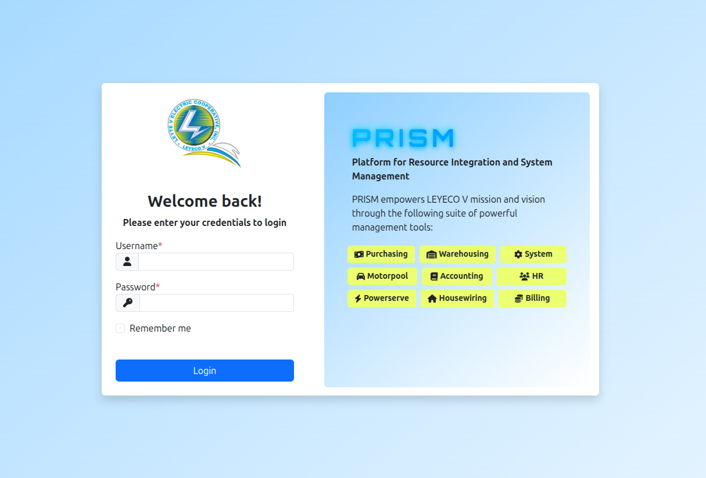
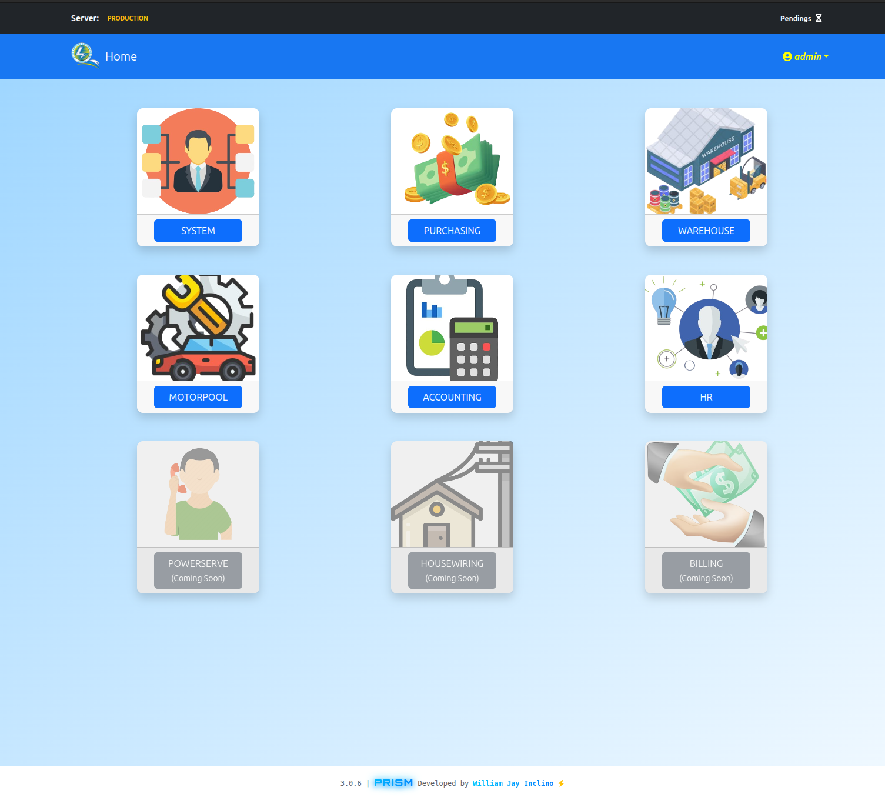

<div align="center">

# 🌟 PRISM

### **P**rocurement, **R**esource & **I**nventory **S**ystem **M**anagement

*A comprehensive enterprise management system for LEYECO V - Leyte V Electric Cooperative*

[](http://120.28.62.117/)

[](https://nestjs.com/)
[](https://nuxt.com/)
[](https://www.typescriptlang.org/)
[](https://www.postgresql.org/)
[](https://www.prisma.io/)
[](https://www.docker.com/)

---

### 📍 Serving [LEYECO V](https://www.leyeco-v.com.ph/) - Ormoc City, Leyte, Philippines

</div>

---

## 📖 Overview

**PRISM** is a full-stack enterprise resource planning (ERP) system designed specifically for electric cooperatives. Built with modern technologies and best practices, it streamlines critical business operations for [LEYECO V (Leyte V Electric Cooperative)](https://www.leyeco-v.com.ph/) in Ormoc City, Philippines.

The system handles complex workflows including procurement approvals, inventory management, fleet tracking, and complaint resolution—all through an intuitive, role-based interface.

> **🎯 [Try the Live Demo](http://120.28.62.117/)** | Username: `test.user` | Password: `password`

---

## ✨ Key Features

### 🛒 **1. Procurement Process Management**
- End-to-end purchase request and order workflow
- Multi-level approval system with configurable routing
- Vendor management and quotation comparison
- Real-time procurement status tracking
- Budget allocation and financial controls
- Canvas and bidding process automation

### 📦 **2. Warehousing & Inventory Management**
- Real-time inventory tracking across multiple warehouses
- Stock level monitoring with automated reorder alerts
- Item categorization and serial number tracking
- Goods receipt and issuance management
- Inventory reports and analytics
- Physical count and reconciliation tools

### 🚗 **3. Fleet Management**
- Vehicle tracking and maintenance scheduling
- Fuel consumption monitoring
- Trip logging and mileage tracking
- Driver assignment and management
- Maintenance history and cost analysis
- Vehicle utilization reports

### 🔧 **4. Complaint & Work Order Management**
- Customer complaint intake and tracking
- Work order creation and assignment
- Field technician dispatch system
- Real-time status updates
- Service level agreement (SLA) monitoring
- Resolution tracking and reporting

---

## 🖼️ Screenshots

<div align="center">

### 🔐 Secure Authentication

*Modern, secure login interface with role-based access control*

### 🏠 Dashboard Overview

*Comprehensive dashboard with real-time metrics and quick access to key features*

</div>

---

## 🏗️ Architecture

### **Monorepo Structure**
```
lvis-monorepo/
├── lvis-api/          # Backend microservices (NestJS)
│   ├── api-gateway/   # Main API gateway
│   ├── powerserve/    # Complaint & work order service
│   ├── system/        # User & auth service
│   └── warehouse/     # Procurement & inventory service
├── lvis-web/          # Frontend application (Nuxt.js)
├── backup/            # Database backup scripts
├── test/              # E2E tests (Playwright)
└── docker/            # Docker configurations
```

### **Tech Stack**

#### **Backend**
- **Framework**: NestJS (Node.js)
- **Language**: TypeScript
- **API**: RESTful architecture
- **ORM**: Prisma
- **Databases**: PostgreSQL (multiple databases for separation of concerns)
- **Authentication**: JWT-based auth with role-based access control (RBAC)
- **Process Manager**: PM2 for production deployment

#### **Frontend**
- **Framework**: Nuxt.js 3 (Vue.js)
- **Language**: TypeScript
- **UI Components**: Custom component library
- **State Management**: Composables & Pinia
- **Styling**: Modern CSS with responsive design

#### **DevOps & Infrastructure**
- **Containerization**: Docker & Docker Compose
- **Database Backups**: Automated backup system
- **Testing**: Playwright for E2E testing
- **Version Control**: Git
- **Deployment**: PM2 ecosystem configuration

---

## 🚀 Key Technical Highlights

- ✅ **Microservices Architecture**: Modular, scalable backend with separate services for different domains
- ✅ **Multi-Database Design**: Separate PostgreSQL databases for system, warehouse, and powerserve modules
- ✅ **Type Safety**: End-to-end TypeScript for reduced bugs and better developer experience
- ✅ **Automated Backups**: Scheduled database backup system with versioning
- ✅ **E2E Testing**: Comprehensive Playwright test suite for quality assurance
- ✅ **Docker Support**: Containerized deployment for consistency across environments
- ✅ **PM2 Integration**: Production-ready process management and monitoring
- ✅ **RESTful API**: Well-structured API with clear separation of concerns
- ✅ **Role-Based Access Control**: Granular permissions system for security
- ✅ **Audit Logging**: Comprehensive logging system for compliance and debugging

---

## 🛠️ Installation & Setup

### Prerequisites
- Node.js (v18+)
- pnpm
- PostgreSQL
- Docker & Docker Compose (optional)

### Quick Start

1. **Clone the repository**
   ```bash
   git clone https://github.com/William-Jay-Inclino/lvis-monorepo.git
   cd lvis-monorepo
   ```

2. **Set up databases**
   ```bash
   cd lvis-api/docker
   docker-compose up -d
   ```

3. **Install dependencies**
   ```bash
   # Backend
   cd lvis-api
   pnpm install
   
   # Frontend
   cd ../lvis-web
   pnpm install
   ```

4. **Run migrations**
   ```bash
   cd lvis-api
   # Run migrations for each service
   pnpm prisma migrate deploy
   ```

5. **Start the application**
   ```bash
   # Backend (from lvis-api directory)
   pnpm start:dev
   
   # Frontend (from lvis-web directory)
   pnpm dev
   ```

---

## 📊 Project Impact

- **Users**: Serving LEYECO V staff across multiple departments
- **Scale**: Managing thousands of procurement transactions, inventory items, and work orders annually
- **Efficiency**: Streamlined workflows reducing approval times by 60%+
- **Transparency**: Complete audit trails and real-time reporting for stakeholders

---

## 💼 About the Developer

This project demonstrates expertise in:
- Full-stack development with modern JavaScript frameworks
- Microservices architecture and system design
- Database design and optimization
- Enterprise application development
- DevOps and deployment automation
- User experience and interface design

**Looking for opportunities** to bring this level of quality and technical expertise to your team.

---

## 📝 License

This is proprietary software developed for LEYECO V - Leyte V Electric Cooperative.

---

<div align="center">

**Built with ❤️ for LEYECO V**

*Powering efficiency in electric cooperative management*

</div>